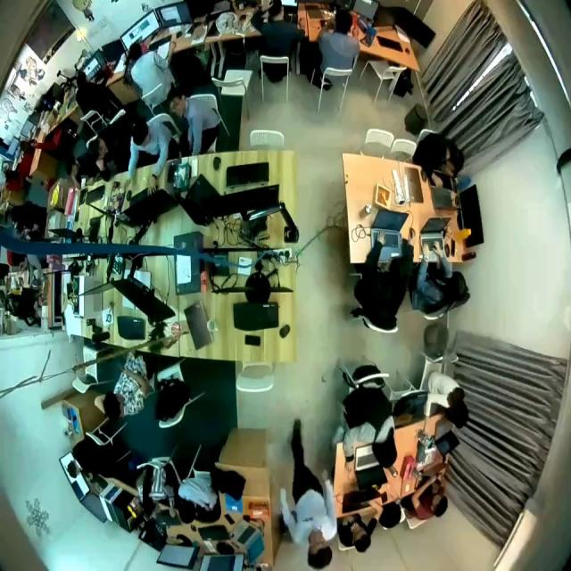
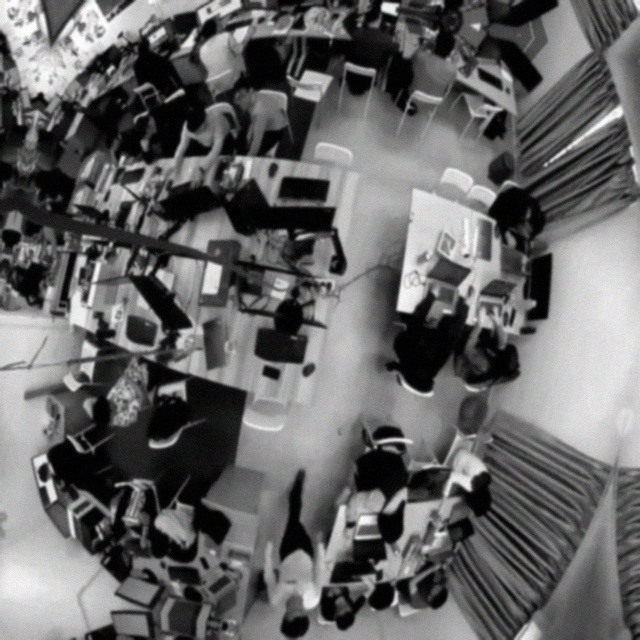
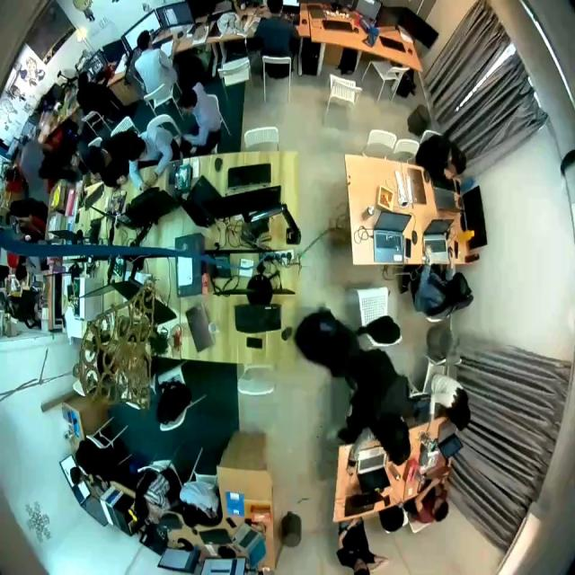
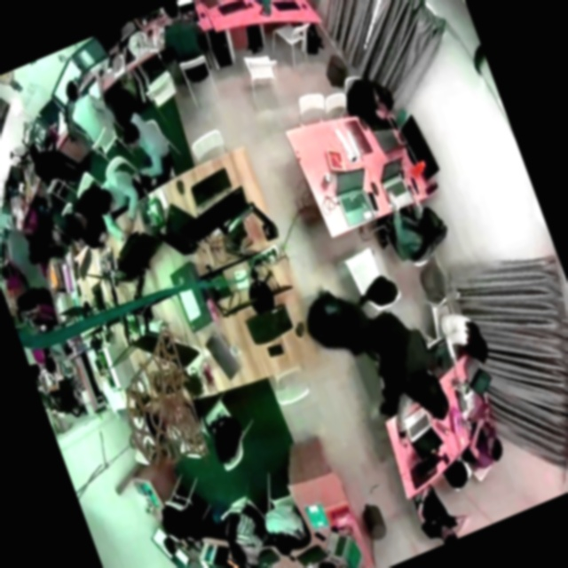
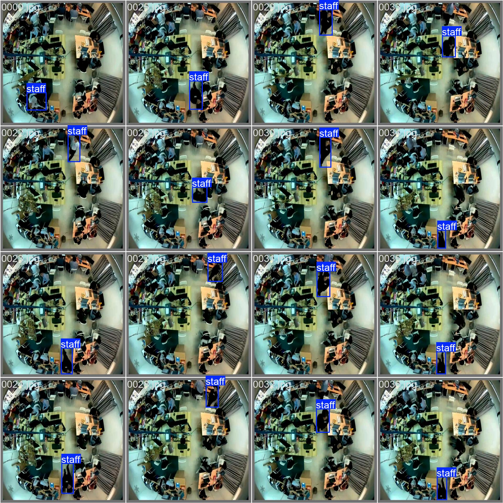

# Staff Tracker
Object Detection based on YOLOv8.

## 📝 Table of Contents
- [Problem Statement](#problem_statement)
- [Idea / Solution](#idea)
- [Getting Started](#getting_started)
- [Usage](#usage)
- [Authors](#authors)
- [Acknowledgments](#acknowledgments)

## 🧐 Problem Statement <a name = "problem_statement"></a>
At FootfallCam, we provide rich footfall data for retail stores as well as advanced analytics and insights to help business decision making. Our 3D sensor uses computer vision and complex AI algorithms to track footfall accurately. One of our key features is staff identification. 

A person is identified as a staff if he or she is wearing a staff name tag. 

## 💡 Idea / Solution <a name = "idea"></a>
It is evident that the problem falls in the realm of object detection and tracking. We implemented [YOLOv8 by Ultralytics](https://github.com/ultralytics/ultralytics/tree/main) for object detection, and it supports both BoT-SORT and ByteTrack tracking algorithms. We choose the former for tracking. 

The video contains a total of 1341 frames, we perform data cleansing to manually select frames where the staff badge is visible. After that we annotate our data using **Roboflow**, the classes are "staff" or the background. 138 frames were selected at last. 

We split our data in a 70:30 ratio for our training set and validation set, amounting 97 frames and 41 frames correspondingly. Data augmentation is necessary due to insufficient training samples. We used **Albumentations** to do so, resulting a total of 1261 training samples. The images are resized to $640 \times 640$ to fit the input size requirements of YOLOv8.

Here are some examples of augmented data:
| Raw Data | Augmented Data |
| --- | --- |
|  |  |
|  |  |

YOLOv8 Nano is chosen as the network architecture, as the model is to be deployed on edge devices.
During training it is fine-tuned on a pretrained model. We conduct training, validation, and prediction on **Google Colab**.

The detection results on the validation set:


Demonstration:
TO-DO


## 🏁 Getting Started <a name = "getting_started"></a>
### Prerequisites
Install the following packages in your environment:
```
pip install ultralytics albumentation
```

### Data Pre-processing
Extract the given video into individual frames. The raw frames will be located at `./imgs/imgs_raw`
```
python ./utils/extract_frames.py
```

The cleansed and labelled data using Roboflow is at `./imgs/imgs_annotate`. Run the following to perform K-Fold split and Data Augmentation on the training set.
```
python ./preprocess.py
```

The augmentation pipeline is defined in the function`augment_img` of `./utils/data_augmentation.py`. The variable `num_aug` is the number of augmentations on a single training sample.
```python
  transform = A.Compose([
    A.Rotate(limit=15, p=0.5),
    A.Affine(shear=20, p=0.5),
    A.ToGray(p=0.15),
    A.HueSaturationValue(hue_shift_limit=20, sat_shift_limit=30, val_shift_limit=20, p=0.5),
    A.RandomBrightnessContrast(brightness_limit=0.2, contrast_limit=0.2, p=0.5),
    A.RandomGamma(gamma_limit=(80, 120), p=0.5),
    A.GaussianBlur(blur_limit=(3, 7), p=0.5),
    A.GaussNoise(var_limit=(10.0, 50.0), p=0.5),
  ], bbox_params=A.BboxParams(format='yolo', label_fields=['labels']))
```

## 🎈 Usage <a name="usage"></a>
### Train
To train the model, run `train.ipynb`. 
```python
model.train(data=dataset_yaml, epochs=epochs, batch=batch, project=project,
            imgsz=640, pretrained=True, augment=True, optimizer='auto', single_cls=True)
```

An alternative is to run this command in the CLI with a `yolo` command, check out at [documentation](https://docs.ultralytics.com/usage/cli/)
```
yolo task=detect mode=train model=yolov8n.pt ARGS
```

By default the best model weights will be saved at `./staff_tracker/train/weights/best.pt`

### Validation
To conduct K-fold cross validation, run `kfold_cv.ipynb`. The default value of K denoted by variable `ksplit` is 5.

### Prediction
For object tracking, run `predict.ipynb`. 
```python
results = model.track(source='/content/drive/MyDrive/footfallcam/data/sample.mp4', show=True, save=True,
                      tracker='botsort.yaml', project='staff_tracker')
```

The final output video (with center_x, center_y) will be saved at `./staff_tracker/track/{video_name}_xy.avi`

## ✍️ Authors <a name = "authors"></a>
- [@junwai7159](https://github.com/junwai7159) - Idea & Initial work


## 🎉 Acknowledgments <a name = "acknowledgments"></a>
- This is part of the take home test conducted by FootfallCam.

